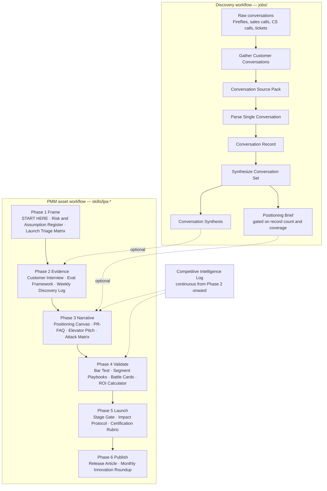

# Product Marketing

A product marketing method, written down as skills an AI agent can execute. The method turns customer evidence into positioning, launch, and enablement assets — and refuses to produce any of them from intuition alone.

The core rule: **evidence before messaging**. Every downstream artifact cites the interview, eval result, or conversation record it came from.

## The two workflows

The repo runs two workflows. Knowing which one you're in tells you which files matter.

1. **Discovery** (`jobs/`) turns raw customer conversations into structured, cited evidence. It runs ahead of and alongside launch work.
2. **PMM assets** (`skills/lpa-*`) is a 19-tab launch workbook that moves a release through six phases, Frame to Publish.

They meet at two optional points. The PMM workflow never blocks on discovery having run — discovery makes it faster and better-grounded when it exists.



Three things that diagram is telling you:

- **The dotted edges are the only connections between the two workflows.** `Conversation Synthesis` briefs live interviews and enriches the weekly log; `Positioning Brief` gives Positioning Canvas a first draft to stress-test. Neither replaces the workbook's own evidence work.
- **The solid chain inside the workbook is enforced order.** `lpa-workflow-map` is the authority: complete tabs in numbered order, and stop when a required input is missing rather than working around it.
- **Competitive Intelligence Log sits outside the sequence.** It runs continuously and pushes updates into Narrative and Validate whenever a signal lands, instead of waiting its turn.

## Start here

Read these three, in this order. Together they cover the whole system.

1. **This README** — what exists and how the pieces relate.
2. **[CLAUDE.md](CLAUDE.md)** — the operating contract. Which skill to use for which job, and the two-workflow split above stated as rules an agent follows.
3. **[skills/lpa-workflow-map/SKILL.md](skills/lpa-workflow-map/SKILL.md)** — the six phases, all 19 tabs, and what feeds what.

Then branch by what you're doing:

| If you're… | Read |
|---|---|
| Mining customer calls for evidence | [Discovery system flow](docs/architecture/discovery-system-flow.md), then [jobs/README.md](jobs/README.md). [Term dictionary](docs/architecture/discovery-term-dictionary.md) for vocabulary, [parse runbook](docs/architecture/parse-single-conversation-runbook.md) for the step-by-step |
| Running a launch end to end | Any skill in `skills/`, starting with [lpa-start-here](skills/lpa-start-here/SKILL.md) |
| Setting up work for a specific client | [Core vs client workspaces](docs/architecture/core-vs-client-workspaces.md), the [client workspace contract](docs/architecture/client-workspace-contract.md), and the [example workspace](examples/client-workspace/README.md) |
| Wiring up Fireflies | [Fireflies native skill mapping](docs/architecture/fireflies-native-skill-mapping.md), [config-aware runbook](docs/architecture/config-aware-customer-conversation-runbook.md) |
| Judging whether an output is good | [evals/README.md](evals/README.md) and the matching rubric |
| Deciding what to build next | [Roadmap](docs/architecture/pmm-agent-roadmap.md), [system architecture](docs/architecture/pmm-agent-system.md), [multi-client backlog](docs/architecture/multi-client-backlog.md) |
| Contributing changes | [GitHub work model](docs/architecture/github-work-model.md), [epics](docs/architecture/epics.md) |

Worked examples live in [examples/](examples/README.md) — parsed conversations, a synthesis, and a full client workspace. Read one when a schema isn't clicking.

## Repo layout

| Directory | Holds | Notes |
|---|---|---|
| `skills/` | 21 skills, one `SKILL.md` each | 19 numbered workbook tabs, plus `lpa-workflow-map` and the continuous `lpa-competitive-intelligence-log` |
| `jobs/` | 3 discovery job specs | Job = trigger, inputs, method, artifacts, review gates, evals |
| `schemas/` | Output contracts | Artifacts passed between stages must conform; some are roadmap scaffolding (see below) |
| `evals/` | Quality rubrics | Human-readable scoring before automation |
| `examples/` | Calibration outputs | What "done" looks like |
| `docs/architecture/` | System design and roadmap | Intent and direction, not executable method |
| `connectors/`, `scripts/` | Fireflies integration and CLI utilities | The only executable code |
| `tests/` | 256 tests | Includes the skill-graph consistency check |

**Core stays client-agnostic.** Skills, jobs, schemas, and evals define how the work gets done. Client-specific taxonomies — segments, competitors, funnel stages, strategic questions — live in a separate client workspace, never in core. See [core vs client workspaces](docs/architecture/core-vs-client-workspaces.md).

**Not everything with a schema is built.** `Persona Pack`, `Buyer Journey Map`, `GTM Plan`, and `Win-Loss Synthesis` have schemas and rubrics but no skill produces them yet. They're roadmap. Don't cite them as a source for a live artifact.

## Conventions that hold it together

Three conventions make the skills compose. Break one and the system stops being a system.

**Artifact names are the interface.** Skills refer to each other by human-readable artifact name in backticks — `Positioning Canvas`, not a file path or slug. The name must match across every skill that mentions it.

**Every skill declares `## Inputs` and `## Handoff`.** Inputs name what must exist first; Handoff names what consumes the output. Together these form a dependency graph, which is what `lpa-workflow-map` renders as phases.

**The graph is tested.** `tests/unit/test_skill_graph.py` parses those sections and fails when an artifact has no producer, a skill depends on a later tab, a skill is missing from the workflow map, or `CLAUDE.md` names a skill that doesn't exist. Adding a skill means adding it to the map and the index — the test enforces it.

## Running things

```bash
python3 -m pytest tests/ -q                              # full suite, 256 tests
python3 scripts/fetch_fireflies_transcripts.py --limit 5 # pull transcripts
python3 scripts/build_conversation_synthesis_input.py records/*.md
python3 scripts/validate_conversation_synthesis.py path/to/synthesis.md
python3 scripts/evaluate_client_workspace.py path/to/workspace
```

`validate_conversation_synthesis.py` checks that every pattern claim cites a supporting record ID. Run it before treating a synthesis as ready for downstream use.
