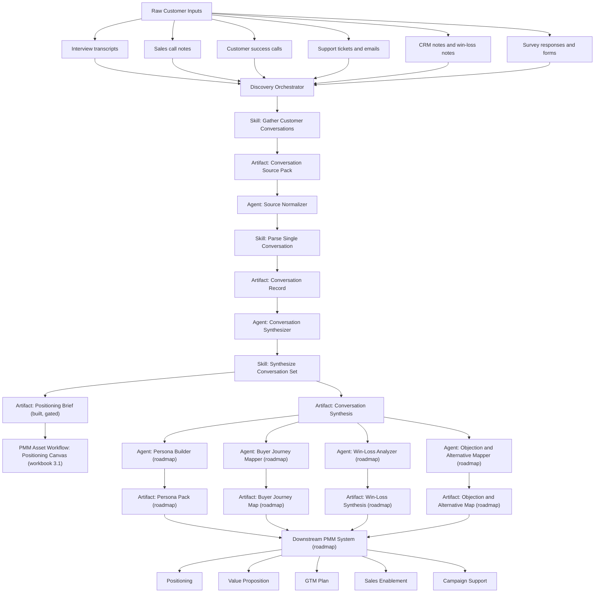
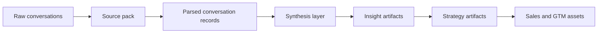

# Discovery System Flow

## Purpose

This document is the roadmap artifact for the discovery-first PMM system.

It defines the recommended structure of:

- discovery-focused agents
- reusable skills
- core evidence artifacts
- downstream dependencies

## Why discovery comes first

The quality of later PMM outputs depends on the quality of discovery.

If the customer evidence layer is weak:

- personas become generic
- positioning becomes speculative
- GTM plans become ungrounded
- sales assets become shallow
- campaign support drifts into content generation without strategy

Because of that, the system should be built from the discovery layer upward.

## Architecture principle

Build:

`raw conversations -> normalized evidence -> parsed records -> synthesis -> insight artifacts -> strategy artifacts -> downstream assets`

Do not invert this order.

## System view

The `Positioning Brief` branch is the only edge in this diagram that's actually wired end to end today — it's produced by the same `Synthesize Conversation Set` job that produces `Conversation Synthesis` (no separate "Positioning Input Builder" agent needed), gated on record count and coverage, and consumed directly by `lpa-positioning-canvas` in the PMM asset workflow. Everything marked `(roadmap)` has a schema and, in some cases, an eval rubric, but no implementing skill or agent — see the build order below before treating any of it as available.

## Simple mental model

## Agent and skill boundaries

### Skills

Skills should hold the stable method.

Discovery-workflow jobs (`jobs/`, this document's subject):

- `Gather Customer Conversations`
- `Parse Single Conversation`
- `Synthesize Conversation Set`

PMM asset-workflow skills that consume discovery output (`skills/lpa-*`, live in the launch workbook — see `lpa-workflow-map`, not this document):

- `Customer Interview` — optionally briefed by `Conversation Synthesis`
- `Weekly Discovery Log` — optionally enriched by `Conversation Synthesis`
- `Positioning Canvas` — optionally accelerated by `Positioning Brief`

### Agents

Agents should execute and orchestrate.

Recommended discovery-first agents:

- `Discovery Orchestrator`
  decides what to run next and tracks workflow state
- `Source Normalizer`
  prepares raw inputs for parsing
- `Conversation Synthesizer`
  aggregates parsed records into evidence patterns
- `Persona Builder`
  turns synthesis into persona-ready output
- `Win-Loss Analyzer`
  extracts loss drivers, win drivers, and objections

## Core artifacts

Built today:

- `Conversation Source Pack`
- `Conversation Record`
- `Conversation Synthesis`
- `Positioning Brief` (gated — see `jobs/synthesize-conversation-set.md`)

Roadmap — schema and/or eval rubric exist, no implementing skill or agent yet:

- `Persona Pack`
- `Buyer Journey Map`
- `Win-Loss Synthesis`
- `Objection and Alternative Map`
- `GTM Plan`

## Recommended build order

### Phase 1: Evidence foundation

Build first:

1. `Gather Customer Conversations`
2. `Parse Single Conversation`
3. `Synthesize Conversation Set`

Definition of done:

- raw sources are inventoried
- parsed records are consistent
- synthesis can support one downstream PMM artifact
- **done — plus one strategy-layer artifact shipped early:** `Synthesize Conversation Set` also produces a gated `Positioning Brief` that feeds `lpa-positioning-canvas` directly. This jumped ahead of Phase 2 below because it required no new agent — see "System view" above.

### Phase 2: Insight layer (roadmap — not started)

Build next:

4. `Persona Pack`
5. `Buyer Journey Map`
6. `Win-Loss Synthesis`
7. `Objection and Alternative Map`

Definition of done:

- the system can produce structured buyer understanding from conversation evidence

### Phase 3: Strategy layer (roadmap — Positioning Brief already shipped, see Phase 1)

Build next:

8. ~~`Positioning Brief`~~ — built, see Phase 1
9. `Value Proposition Brief`
10. `GTM Plan`

Definition of done:

- strategy outputs are grounded in evidence rather than invented from scratch

### Phase 4: Downstream asset layer

Build after discovery and strategy are stable:

11. `Battle Cards`
12. `Sales Scripts`
13. `ROI Assets`
14. `Demand Messaging`
15. `Campaign Support`

## Solo-builder recommendation

For one person, do not start with a full multi-agent system.

Start with:

- one lightweight orchestrator
- three discovery-first skills
- three stable schemas
- human review on every output

That means:

- agent complexity stays low
- output quality stays inspectable
- later automation has a clean evidence foundation

## Roadmap decision rule

If a proposed PMM workflow cannot clearly say:

- what discovery evidence it needs
- what evidence artifact it consumes
- what structured artifact it produces

then it should not be built yet.

## Repo connections

This roadmap artifact connects to:

- [First Workstream: Customer Conversations](first-workstream-customer-conversations.md)
- [PMM Agent System](pmm-agent-system.md)
- [Client Workspace Contract](client-workspace-contract.md)
- [Config-Aware Customer Conversation Runbook](config-aware-customer-conversation-runbook.md)
- [Jobs README](../../jobs/README.md)
