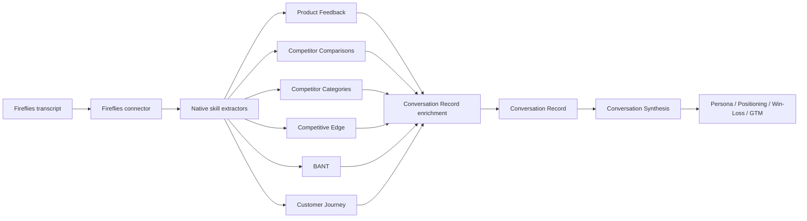

# Fireflies Native Skill Mapping

## Purpose

Map useful Fireflies-native skills into the PMM discovery architecture as upstream signal extractors.

These skills should not replace the PMM method, schemas, or synthesis logic in this repo.

Use them to:

- accelerate signal extraction from transcripts
- enrich `conversation-record` artifacts
- support `conversation-synthesis`
- reduce manual tagging work in discovery

Do not use them as final PMM outputs.

## Decision rule

Use a Fireflies-native skill only if it does at least one of these well:

- extracts evidence faster than manual review
- populates a field that already exists in a repo schema
- helps route conversations into the right PMM workflow
- preserves or improves evidence quality without hiding provenance

Avoid using native skills that:

- only create generic summaries
- do not preserve traceability
- duplicate your proprietary PMM method without adding structured evidence

## Recommended native skills

### 1. `Product Feedback`

Why it is useful:

- strong fit for the discovery layer
- can speed up extraction of product issues, requests, and qualitative signal

Best place in the pipeline:

- after `Gather Customer Conversations`
- before or during `Parse Single Conversation`

Best schema targets:

- [conversation-record.md](/Users/jacklindberg/Documents/Product%20Marketing/schemas/conversation-record.md)
  likely fields:
  `primary_pains`, `secondary_pains`, `desired_outcomes`, `summary_of_signal`
- [conversation-synthesis.md](/Users/jacklindberg/Documents/Product%20Marketing/schemas/conversation-synthesis.md)
  likely fields:
  `top_recurring_pains`, `strongly_supported_patterns`, `emerging_patterns`

How to use it:

- treat it as a first-pass extractor of product-related pains and requests
- feed its output into the PMM parser, not directly into downstream artifacts

Priority:

- `high`

### 2. `Competitor Comparisons`

Why it is useful:

- directly relevant to competitive discovery
- likely to surface how buyers compare offerings in real conversations

Best place in the pipeline:

- during `Parse Single Conversation`
- again during `Synthesize Conversation Set`

Best schema targets:

- [conversation-record.md](/Users/jacklindberg/Documents/Product%20Marketing/schemas/conversation-record.md)
  likely fields:
  `current_alternatives`, `competitors_mentioned`, `objections`, `evaluation_criteria`
- [conversation-synthesis.md](/Users/jacklindberg/Documents/Product%20Marketing/schemas/conversation-synthesis.md)
  likely fields:
  `current_alternatives`, `competitors_and_substitutes`, `objections`, `strategic_implications`

How to use it:

- capture competitor mentions and comparative language
- require downstream validation against cited transcript evidence

Priority:

- `high`

### 3. `Competitor Categories`

Why it is useful:

- good lightweight enrichment layer
- can help normalize competitor signals across many conversations

Best place in the pipeline:

- during `Parse Single Conversation`
- during synthesis clustering

Best schema targets:

- [conversation-record.md](/Users/jacklindberg/Documents/Product%20Marketing/schemas/conversation-record.md)
  likely fields:
  `competitors_mentioned`, `current_alternatives`, `term_normalization_notes`
- [conversation-synthesis.md](/Users/jacklindberg/Documents/Product%20Marketing/schemas/conversation-synthesis.md)
  likely fields:
  `competitors_and_substitutes`, `emerging_patterns`

How to use it:

- use it to normalize and group competitor mentions
- do not let category labels overwrite the exact competitor terms buyers used

Priority:

- `high`

### 4. `Competitive Edge`

Why it is useful:

- can help extract perceived advantages and reasons-to-believe from real calls
- useful input for future battle cards and positioning work

Best place in the pipeline:

- during `Parse Single Conversation`
- especially helpful in late-stage commercial calls

Best schema targets:

- [conversation-record.md](/Users/jacklindberg/Documents/Product%20Marketing/schemas/conversation-record.md)
  likely fields:
  `evaluation_criteria`, `trust_requirements`, `language_to_use`, `summary_of_signal`
- [conversation-synthesis.md](/Users/jacklindberg/Documents/Product%20Marketing/schemas/conversation-synthesis.md)
  likely fields:
  `evaluation_criteria`, `trust_requirements`, `strategic_implications`

How to use it:

- treat it as a source of perceived strengths, not objective truth
- compare its output to actual customer language and objections

Priority:

- `high`

### 5. `BANT`

Why it is useful:

- strong commercial-call enrichment
- good fit for deal-stage and buying-process signal

Best place in the pipeline:

- during `Parse Single Conversation`
- especially on late-stage sales or pricing calls

Best schema targets:

- [conversation-record.md](/Users/jacklindberg/Documents/Product%20Marketing/schemas/conversation-record.md)
  likely fields:
  `buying_triggers`, `evaluation_criteria`, `open_questions`, `summary_of_signal`
- later possible downstream artifact:
  GTM and sales-enablement workflows

How to use it:

- treat BANT as supporting commercial context, not as the main PMM lens
- avoid letting it flatten richer discovery signal

Priority:

- `medium-high`

### 6. `Customer Journey`

Why it is useful:

- can help capture how the customer discovered, evaluated, and moved through the buying process
- useful bridge between discovery and buyer-journey work

Best place in the pipeline:

- during `Parse Single Conversation`
- during `Synthesize Conversation Set`
- later in `Buyer Journey Map`

Best schema targets:

- [conversation-record.md](/Users/jacklindberg/Documents/Product%20Marketing/schemas/conversation-record.md)
  likely fields:
  `buying_triggers`, `current_alternatives`, `evaluation_criteria`, `summary_of_signal`
- [conversation-synthesis.md](/Users/jacklindberg/Documents/Product%20Marketing/schemas/conversation-synthesis.md)
  likely fields:
  `buying_triggers`, `strongly_supported_patterns`, `strategic_implications`

How to use it:

- use it to support buyer-journey understanding
- keep exact journey steps anchored to transcript evidence

Priority:

- `medium-high`

## Lower-priority native skills

These may be useful later, but should not be in the first wave:

- `Churn Risk`
  better for retention or customer-success PMM later
- `Customer Snapshot`
  potentially helpful for account context, but less important than core discovery evidence
- `Launch Threats`
  more useful after discovery and competitive evidence are already strong
- `Marketing Channels`
  downstream of discovery, positioning, and GTM strategy

## Pipeline placement

## Suggested implementation order

### Phase 1

Add first:

1. `Product Feedback`
2. `Competitor Comparisons`
3. `Competitor Categories`

Why:

- these enrich the strongest current discovery workflows
- they map cleanly into existing schemas
- they improve evidence density without changing downstream architecture

### Phase 2

Add next:

4. `Competitive Edge`
5. `BANT`
6. `Customer Journey`

Why:

- these add more interpretive commercial and journey context
- better once the base parsing and synthesis loop is stable

## Repo implications

The likely next additions if these are implemented:

- extend [conversation-record.md](/Users/jacklindberg/Documents/Product%20Marketing/schemas/conversation-record.md) with optional `native_extractor_signals`
- add a Fireflies enrichment script that fetches transcript plus selected native-skill outputs
- add validation rules that native-skill output must not replace transcript-cited evidence

## Recommendation

Treat Fireflies-native skills as:

- `retrieval and extraction helpers`

Do not treat them as:

- `the PMM system`

Your moat stays in:

- source-faithful schemas
- evidence-preserving parsing
- synthesis with citations
- downstream PMM method and artifacts
